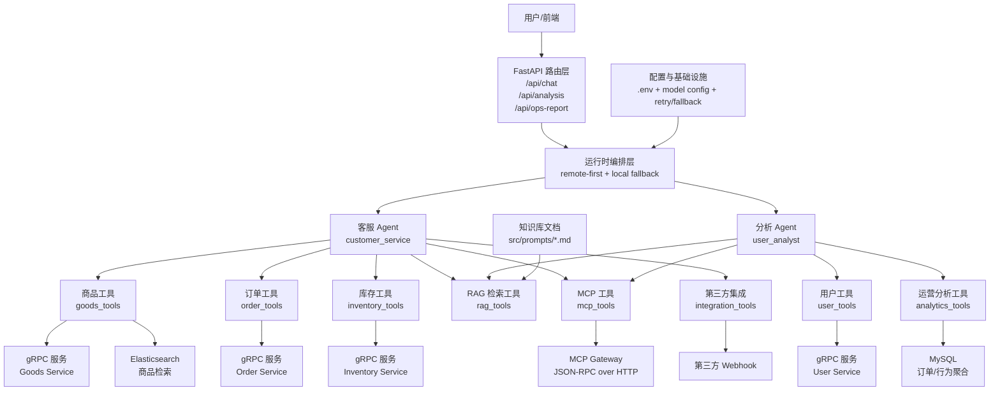

# Lushop Chatbot 项目主要知识点总结

## 1. 项目定位与目标
- 项目是一个面向电商场景的智能助手，技术基座是 FastAPI + LangChain。
- 核心目标是把客服问答、商品检索、订单处理、库存查询、用户分析、运营分析整合到一条 Agent 化链路中。
- 系统强调 可降级、可观测、可扩展：云端模型可用时走智能体，不可用时走本地规则与工具兜底。

## 2. 架构分层设计
- API 层：对外提供统一 HTTP 接口，负责参数校验和异常封装。
- Agent 层：定义客服与分析两个业务 Agent，以及运行时调度策略。
- Tool 层：封装 gRPC、RAG、MCP、MySQL、Webhook 等能力，作为 Agent 可调用工具。
- 基础设施层：模型配置、重试回退、环境变量加载、proto/gRPC 客户端。

## 3. LangChain Agent 设计要点
- 采用 create_agent 构建领域 Agent，分别针对客服与用户分析职责。
- 工具组合体现领域编排：
  - 客服 Agent：商品、订单、库存、RAG、MCP、Webhook。
  - 分析 Agent：用户信息、订单历史、行为分析、运营指标聚合、报告生成、RAG、MCP。
- Prompt 不是泛用问答，而是明确业务边界和输出目标，符合电商专属 Agent 思路。

## 4. 任务编排与降级策略
- 运行时采用 remote-first：优先调用云端模型。
- 当模型调用失败时，自动回退本地 deterministic 流程，保证接口可用。
- 本地客服链路有轻量 Plan 机制：
  - 先做知识检索。
  - 再根据意图触发库存、订单、商品详情或商品搜索。
  - 无明确意图则给出引导建议。
- 本地用户分析链路按 用户信息 + 订单历史 + RAG 参考 + 行为分析 + 报告生成 串联。

## 5. RAG 检索实现要点
- 使用混合检索策略：embedding 检索优先，关键词检索兜底。
- embedding 仅在依赖与 API Key 都可用时启用，避免硬依赖导致不可运行。
- 知识库来源于 src/prompts 下 Markdown 文档，支持自动切分和简单打分。
- 产出为结构化 JSON，包含 query、mode、hits，便于下游解释和调试。

## 6. ES 商品检索与 gRPC 回退
- 商品检索支持优先走 ES 通道（GoodsListES），提升检索质量与可扩展性。
- 当 ES 能力不可用或网关不支持时，自动回退普通 gRPC 查询。
- 工具层统一格式化返回，降低 Agent 侧解析复杂度。

## 7. MySQL 运营分析能力
- 核心能力：自动汇总订单量、支付订单量、活跃用户、GMV、支付转化率、ARPU。
- 支持一定程度的异构库适配：
  - 自动识别候选订单表名（order_info / orders / order）。
  - 自动识别时间、用户、支付状态、金额字段。
  - 支持多个候选数据库扫描（MYSQL_DATABASES）。
- 结果包含 source 字段（mysql 或 fallback），便于判断真实数据链路是否打通。

## 8. MCP 协议接入
- 通过 JSON-RPC over HTTP 调用 MCP 网关工具。
- 支持 method + params 的通用调用结构，便于后续扩展更多 MCP 能力。
- 错误处理覆盖参数解析、HTTP 异常、网关失败，返回结构化错误信息。

## 9. 第三方服务集成
- 提供 webhook 通用工具，支持向外部系统推送 JSON 事件。
- 运营报告接口支持可选推送：生成报告后可同步发送至外部告警/BI/自动化平台。
- 设计上把第三方调用放在工具层，避免业务逻辑和外部协议强耦合。

## 10. API 设计与工程实践
- 对外接口聚焦三类核心能力：
  - 聊天客服：/api/chat
  - 用户分析：/api/analysis
  - 运营报告：/api/ops-report
- 使用 Pydantic 模型做请求校验，失败路径统一 HTTPException。
- 健康检查接口用于部署与监控联动。

## 11. 配置与可运维性
- 配置由 .env 驱动，覆盖 LLM、gRPC 地址、ES、MySQL、MCP、Webhook。
- 模型配置支持多供应商与优先级选择，且检查 provider SDK 是否安装。
- 当 key 缺失或 SDK 不可用时，系统仍可在本地链路运行，降低开发调试门槛。

## 12. 项目亮点
- 不是单一问答机器人，而是 业务工具链驱动 的电商智能体。
- 把 RAG、ES、MySQL、MCP、Webhook 放进统一 Agent 生态，具备工程落地价值。
- 同时提供 智能模式 与 稳定兜底模式，能在复杂环境中保持服务连续性。

## 13. 当前已知风险与优化方向
- 真实 MySQL 数据链路依赖目标库中存在订单表；若无表会 fallback。
- 下游 gRPC 服务未启动时，工具会返回错误信息，建议接入统一重试与熔断策略。
- RAG 当前更偏轻量实现，后续可引入持久化向量库、重排模型、离线构建流程。
- 运营分析可继续增强：留存、复购、漏斗、分群、同比环比、可视化图表输出。

## 14. 一句话总览
- 这是一个面向电商业务的 LangChain 多工具智能体项目，重点在于把 对话能力 转化为 可执行业务流程，并通过降级与集成机制保证线上可用性。

## 15. 项目框图（Mermaid）

  ## 16. 项目启动流程

  ### 16.1 进入项目目录
  1. 切换到项目根目录：

    cd /home/ubuntu/lushop-chatbot-py

  ### 16.2 准备 Python 虚拟环境
  1. 若已经有 .venv，直接激活：

    source .venv/bin/activate

  2. 若没有 .venv，先创建再激活：

    python3 -m venv .venv
    source .venv/bin/activate

  ### 16.3 安装依赖
  1. 安装运行所需核心依赖：

    pip install fastapi uvicorn langchain grpcio grpcio-tools python-dotenv requests pymysql

  ### 16.4 配置环境变量
  1. 编辑 .env，至少确认以下项：
     - OPENAI_API_KEY / ANTHROPIC_API_KEY / XAI_API_KEY / GOOGLE_API_KEY（至少一个可选；没有也可走本地兜底）
     - GOODS_SERVICE_ADDR
     - ORDER_SERVICE_ADDR
     - USER_SERVICE_ADDR
     - INVENTORY_SERVICE_ADDR
     - MYSQL_HOST
     - MYSQL_PORT
     - MYSQL_USER
     - MYSQL_PASSWORD
     - MYSQL_DATABASE
     - MCP_HTTP_ENDPOINT（如需 MCP）

  2. 如果 MySQL 库名不确定，可增加：
     - MYSQL_DATABASES=aidoc,lushop（按实际情况填写多个候选库）

  ### 16.5 启动服务
  1. 在项目根目录执行：

    uvicorn src.api.routes:app --host 127.0.0.1 --port 8100

  2. 若 8100 端口已占用，改用其他端口：

    uvicorn src.api.routes:app --host 127.0.0.1 --port 8101

  ### 16.6 启动后验证
  1. 健康检查：

    curl http://127.0.0.1:8100/health

  2. 客服接口验证：

    curl -X POST http://127.0.0.1:8100/api/chat -H "Content-Type: application/json" -d '{"message":"推荐一款苹果手机","user_id":1}'

  3. 用户分析接口验证：

    curl -X POST http://127.0.0.1:8100/api/analysis -H "Content-Type: application/json" -d '{"user_id":1,"report_type":"comprehensive"}'

  4. 运营报告接口验证：

    curl -X POST http://127.0.0.1:8100/api/ops-report -H "Content-Type: application/json" -d '{"days":30}'

  ### 16.7 常见问题排查
  1. 报错 address already in use：
     - 端口被占用，换端口启动，或先停止占用进程。

  2. 报错 gRPC UNAVAILABLE：
     - 下游 goods/order/user/inventory 服务未启动或地址配置错误。

  3. 运营数据 source=fallback：
     - 先检查 MySQL 账号密码与库名。
     - 再检查目标库是否存在订单表（order_info / orders / order）。

  4. 没有大模型 Key：
     - 系统会自动走本地兜底链路，接口仍可运行，但智能效果会受限。
